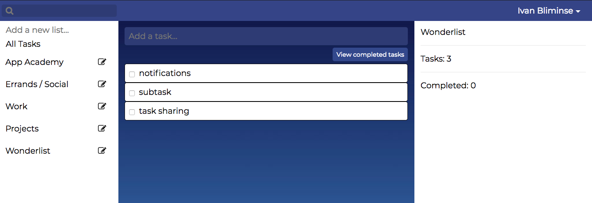

# Wonderlist 
Wonderlist is a single-page application inspired by Wunderlist & Remember the Milk. Built with Rails, React/Redux and PostgreSQL. Wonderlist allows users to easily keep track of thier to-dos.

[Live Demo](https://wonder-list.herokuapp.com/#/)
## Features 
* Secure user authentication
* Lists to organize tasks 
* taks to keep track of to-dos
* Summary of user's progress 
* Search taks by keywords


Password is stored as an encrypted hash.
``` ruby 
  def password=(password)
    @password = password
    self.password_digest = BCrypt::Password.create(password)
  end
```
Tasks are retrieved based on params.
```ruby 
  tasks = Task.where(user_id: current_user.id)

  if params[:query]
    tasks = tasks.where(completed: false)
    @tasks = tasks.where(["LOWER(title) LIKE ?", "%#{params[:query].downcase}%"])
  elsif params[:listId]
    @tasks = tasks.where(list_id: params[:listId])
  else
    @tasks = tasks
  end
```
Ajax request to our api endpoints.
``` javascript
export const fetchTasks = (listId, query) => (
  $.ajax({
    method: 'GET',
    url: '/api/tasks/',
    data: {listId, query}
  })
);
```
## To-do

